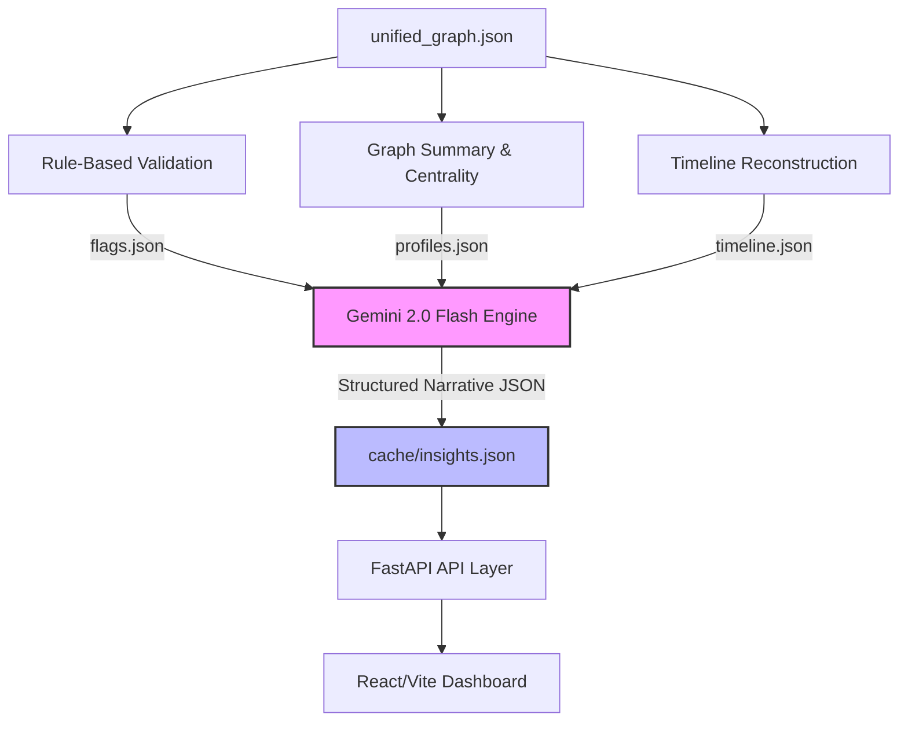

# TATVA Memory & Insights Architecture
This document details the system design, data flows, validation engines, and LLM prompts for TATVA's **Memory & Insights Layer**.



---

## 🗄️ 1. The Memory Layer

To ensure rapid response times and avoid excessive API bills/limits, TATVA uses a **three-tier persistent memory layer** stored directly on disk inside the `backend/` directory.

### Memory Storage Map
```
backend/
├── unified_graph.json          ← Tier 1: Source of Truth (Fuzzily-resolved Graph)
├── all_preprocessed_graphs.json← Tier 1: Intermediary merged preprocessor outputs
│
├── cache/                      ← Tier 2: Derived Intelligence (Auto-generated)
│   ├── structured_flags.json   ← Rule Engine violation flags
│   ├── entity_profiles.json    ← Node centrality & data source counts
│   ├── timeline.json           ← Chronologically ordered & windowed scenes
│   ├── insights.json           ← LLM-generated briefings and suspect risk reports
│   └── graph_summary.json      ← High-level graph metadata and stats
│
└── annotations/                ← Tier 3: Manual Investigator State
    └── annotations.csv         ← Human-written relations, overrides, and notes
```

### Cache Invalidation Policy
Whenever a new preprocessing run is executed (producing a modified `unified_graph.json`), the `cache/` directory is automatically invalidated.
* **Mechanism:** A startup timestamp check compares the modification time (`mtime`) of `unified_graph.json` with `cache/insights.json`. If `unified_graph.json` is newer, the system automatically triggers a clean recomputation of all Tier 2 cached items.

---

## 🧱 2. Rule-Based Validation Layer

Before invoking the LLM, a local, deterministic Python engine evaluates the graph's entities and relations against predefined rules. This keeps findings objective, concrete, and grounded.

### Evaluated Rules

| Rule Identifier | Violation Logic | Output Payload |
|:---|:---|:---|
| **`SMURFING_DETECTED`** | A single source account sends multiple transfers within a 30-minute window, with each transfer under a critical threshold (e.g., ₹10,000) to bypass AML detection. | `{"account": "ACC1001", "recipients": ["ACC2001", "ACC3001"], "total_amount": 31500, "count": 5}` |
| **`IMPOSSIBLE_TRAVEL`** | A wearable or mobile GPS indicates a distance traveled between consecutive timestamps that would require a speed exceeding physical limits (e.g., 200 km/h in a city). | `{"device": "WATCH_ABC", "locations": ["LocA", "LocB"], "duration_min": 5, "implied_speed_kmh": 240}` |
| **`COMMUNICATION_BURST`** | Two master entities exchange more than 10 calls or messages within a single 60-minute window. | `{"actors": ["MASTER_rahul", "MASTER_arjun"], "count": 14, "window": "20:30-21:30"}` |
| **`RENDEZVOUS`** | Multiple entities have overlapping GPS pings (within ±15 mins) that fall within a 50-meter radius of the same location. | `{"actors": ["MASTER_rahul", "MASTER_arjun", "MASTER_vikram"], "location": "Park Street", "timestamp": "21:15"}` |
| **`FORENSIC_HIT`** | A communication record has an explicit signal flag set to true (e.g. `delete_instruction`, `urgency_language`, or `impersonates_bank`). | `{"channel": "email", "source": "MASTER_rahul", "target": "MASTER_arjun", "signal": "delete_instruction"}` |
| **`CO-CORROBORATION`** | An entity appears in 3 or more distinct raw data source types (e.g., FIR + Bank + CDR). | `{"entity": "MASTER_rahul", "sources": ["fir", "bank", "cdr", "gps"]}` |

---

## ⏱️ 3. Timeline Reconstruction

Reconstruction groups relations by time windows and groups them into sequential **"Scenes"**.

### Structured JSON Timeline Output (`cache/timeline.json`)
```json
{
  "incident_window": "2026-05-22T20:30:00 to 2026-05-22T22:40:00",
  "scenes": [
    {
      "scene_id": "SCENE_01",
      "window": "20:30 - 21:00",
      "label": "Operational Setup & Bursty Comms",
      "summary": "Coordinated planning signals detected across email and chat.",
      "events": [
        {
          "timestamp": "2026-05-22T20:30:00",
          "action": "EMAILED",
          "from": "Rahul Sen",
          "to": "Arjun Ghosh",
          "details": "Subject: Tonight's transfer. Flagged: delete_instruction"
        },
        {
          "timestamp": "2026-05-22T20:45:00",
          "action": "MESSAGED",
          "from": "Rahul Sen",
          "to": "Group Chat",
          "details": "Text: Arjun, transfer work will happen near Park Street tonight."
        }
      ],
      "active_flags": ["FORENSIC_HIT", "COMMUNICATION_BURST"]
    },
    {
      "scene_id": "SCENE_02",
      "window": "21:00 - 21:30",
      "label": "Physical Assembly",
      "summary": "Suspects arrive near the target location.",
      "events": [
        {
          "timestamp": "2026-05-22T21:15:00",
          "action": "LOCATED_AT",
          "from": "Rahul Sen",
          "to": "Park Street Coordinate",
          "details": "Accuracy: 5.2m"
        }
      ],
      "active_flags": ["RENDEZVOUS"]
    }
  ]
}
```

---

## 🤖 4. LLM Narrative & Pattern Explanation

By piping deterministic structures (validation flags, timeline scenes, and centrality profiles) into the LLM instead of the raw, messy graph, we eliminate hallucinations and slash token usage.

### 🏆 Model Selection: **Gemini 2.0 Flash**
* **Provider:** Google AI Studio (Free API Tier)
* **API Limits:** 15 requests per minute, 1,500 requests per day (perfect for hackathons and demos).
* **Context Capacity:** 1 Million tokens (highly scalable if the graph expands).
* **Core Strength:** Native support for strict JSON schema output (`response_mime_type: "application/json"`).

### Strict Prompt Template
```
You are an expert forensic intelligence analyst. Your task is to analyze pre-computed graph features, timeline scenes, and violation flags, and construct a high-impact, cohesive intelligence summary.

STRICT INSTRUCTIONS:
- You must ONLY use the provided facts. Do not assume or extrapolate external events.
- Highlight cross-source corroboration as evidence strength.
- Focus heavily on high-centrality suspect nodes.

INPUT PROFILES:
{entity_profiles}

INPUT SCENES:
{timeline_scenes}

INPUT RULES INFERRED:
{structured_flags}

Return a single JSON block exactly matching this JSON Schema:
{
  "executive_summary": "High-level paragraph describing the coordinated incident.",
  "key_suspects": [
    {
      "name": "Suspect Name",
      "role_in_incident": "Synthesized brief based on communications and actions",
      "threat_level": "CRITICAL|HIGH|MEDIUM|LOW",
      "supporting_evidence": ["Evidence 1", "Evidence 2"]
    }
  ],
  "timeline_analysis": "A summary of how the narrative unfolded chronologically through the scenes."
}
```

---

## ⚡ 5. Implementation Roadmap

### Step 1: The Deterministic Engine (`backend/insights/`)
Create the core Python module to read `unified_graph.json` and generate raw cache files.
* **1.1: `graph_summary.py`** (Extracts entity counts, relation types, and boundaries).
* **1.2: `entity_profiles.py`** (Uses `networkx` to calculate Degree and Betweenness centrality).
* **1.3: `timeline_builder.py`** (Groups and sequences timestamped events into scene windows).
* **1.4: `rule_engine.py`** (Scans coordinates for co-location and transaction databases for smurfing).

### Step 2: Gemini LLM Integration
* Create `insights/llm_narrator.py` using `google-genai`.
* Formulate prompts and cache the final generated narrative into `cache/insights.json`.

### Step 3: FastAPI endpoints
Expose the cached JSON files through direct, rapid GET requests.

---

## 🧠 6. Graph Neural Networks (GNN) Discussion

We have decided to **skip a GNN for the initial prototype** for several reasons:
1. **Size Constraint:** With ~37 nodes and ~60 relations, a GNN would overfit completely and fail to learn meaningful general patterns.
2. **Missing Labels:** Supervised node/edge classification requires hundreds of pre-labeled historical graph datasets.
3. **Complexity Overhead:** Setting up PyTorch Geometric or DGL is a massive time sink for a hackathon demo.

### High-Impact Alternative: **Node2Vec Embeddings**
Instead of training a GNN, we can run a lightweight, unsupervised **Node2Vec** (or DeepWalk) script.
* **What it does:** Translates each master entity into a 64-dimensional dense vector based on their structural neighborhood.
* **Why it's useful:** You can compute cosine similarity between nodes to automatically highlight entities that share structural behaviors (e.g., *"Phone number X is structurally identical to Suspect Y's device, suggesting an alternate burner phone"*).
